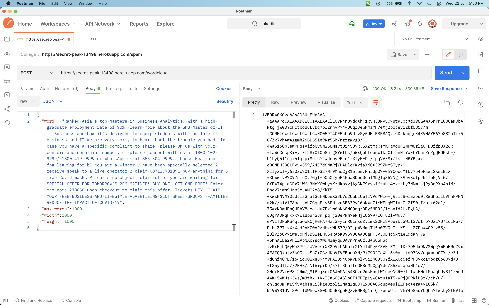

# Comments Data Analysis using NLP and Machine Learning

Api Link : https://secret-peak-13498.herokuapp.com/

`Modified Version` : https://github.com/Gaurav0824/Api-majorProject-server

`Api Link` : https://protected-gorge-33386.herokuapp.com/

 

This is the backend api serving the website.

This api is used to perform the following tasks:

- Spam Filtering (Naive Bayes)
- Sentimental Analysis (Vader)
- Topic Modelling (LDA)

        Topic modelling is computationally expensive and does not work with free tier accounts.
        The app dyno kills on high cpu usage.
        The api needs to be hosted on a paid account to use topic modelling.
        A work-around is to use LDA available with nodejs and perform topic modelling on the client side.
           https://www.npmjs.com/package/lda

- Create Word-Clouds

The website built using this api can be found at

Project Link : https://fastidious-taffy-09c112.netlify.app/

Github Link :

Colab Link : https://colab.research.google.com/drive/11-ZTT6o9waxcJ3wmNUEWyBNlalRs-gIq?usp=sharing

## ScreenShots

 

Spam : https://secret-peak-13498.herokuapp.com/spam

 

<!--  -->

 

Sentiment : https://secret-peak-13498.herokuapp.com/sentiment

 

<!--  -->

 

Word Cloud : https://secret-peak-13498.herokuapp.com/wordcloud

 

| Params    | Description                      |
| --------- | -------------------------------- |
| word      | Concatenated String of sentences |
| max_words | Max. number of words to include  |
| width     | width in pixels                  |
| height    | height in pixels                 |

 

Use this encoded output in image tag as `base64` string to create a word cloud.

    

